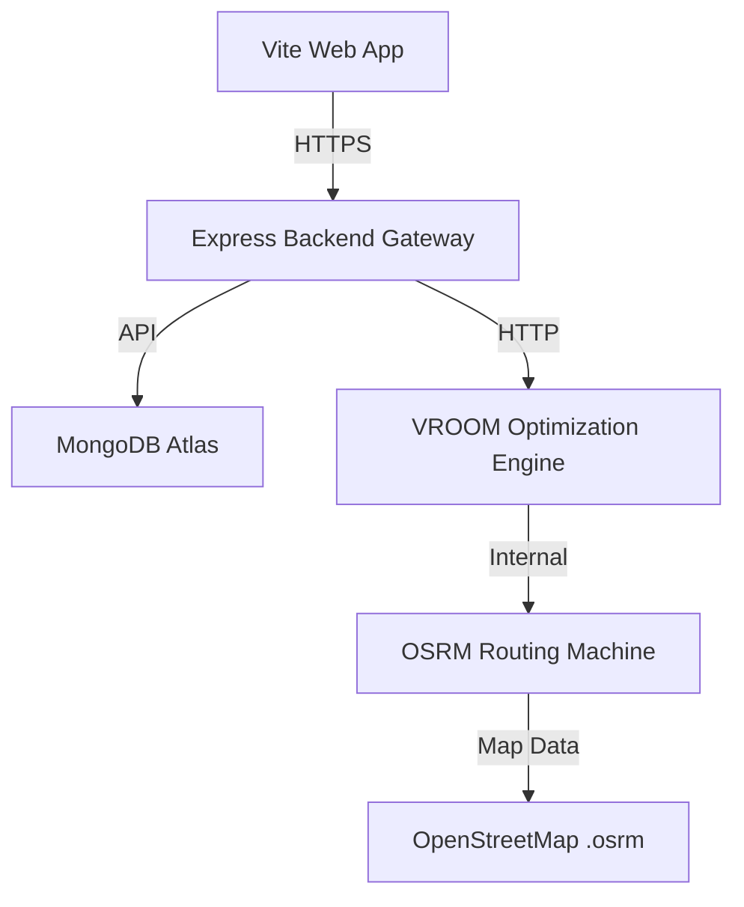

# 🎯 Optimize Route - Intelligent Logistics Optimization System


A state-of-the-art route optimization and parcel distribution system designed for large-scale logistics. This platform leverages **OSRM** for road mapping and **VROOM** for multi-vehicle optimization, providing routes that minimize fuel costs and delivery time.

---

## 🏗️ System Architecture



## 🚀 Getting Started

### 1. Prerequisites (Docker)
Ensure Docker is installed and running. This project requires OSRM and VROOM for core operations.

```bash
cd RouteLibrary
docker command compose up -d
```
*Note: The system is configured with the "Western Zone" (Ahmedabad/Gujarat) extract. Make sure OSRM has at least 4GB of RAM allocated in Docker Settings.*

### 2. Backend Setup
```bash
cd backend
npm install
npm run dev # Starts on port 5001 with Diagnostics
```

### 3. Frontend Setup
```bash
cd frontend
npm install
npm run dev # Starts on port 5173
```

---

## ☁️ Deployment Guide

### Vercel (Frontend)
1. Link your GitHub repo to **Vercel**.
2. Root Directory: `frontend`
3. Framework: `Vite`
4. Env Var: `VITE_API_URL` -> `https://your-backend.onrender.com/api`

### Render (Backend)
1. Create a **Web Service** on **Render**.
2. Root Directory: `backend`
3. Environment Variables:
   - `MONGODB_URI`: `<Atlas Connection String>`
   - `FRONTEND_URL`: `https://your-app.vercel.app`
   - `OSRM_HOST`: `https://your-osrm-docker.onrender.com`
   - `VROOM_HOST`: `https://your-vroom-docker.onrender.com`

### Docker Infrastructure (OSRM & VROOM)
To deploy the optimization engines, you must push the pre-processed map data. 
> [!IMPORTANT]
> **Git LFS**: Since the `.osrm` files in `RouteLibrary/osrm-data` exceed 100MB, you **must** use [Git LFS](https://git-lfs.github.com/) to push them to GitHub.

---

## 🛠️ Tech Stack & Features
- **Frontend**: React 19, Vite, Leaflet (Mapping), Framer Motion (UI/UX)
- **Backend**: Node.js 20, Express, MongoDB, JWT Authentication
- **Optimization**: VROOM (Vehicle Routing Open-source Optimization Machine)
- **Road Routing**: OSRM (Open Source Routing Machine)
- **Features**: 
  - Dynamic Route Recalculation
  - Multi-Driver Distribution Strategy
  - Real-time Status Updates
  - Mobile-Responsive Warehouse Management

---
Developed as part of the **Digimonk Internship**.
